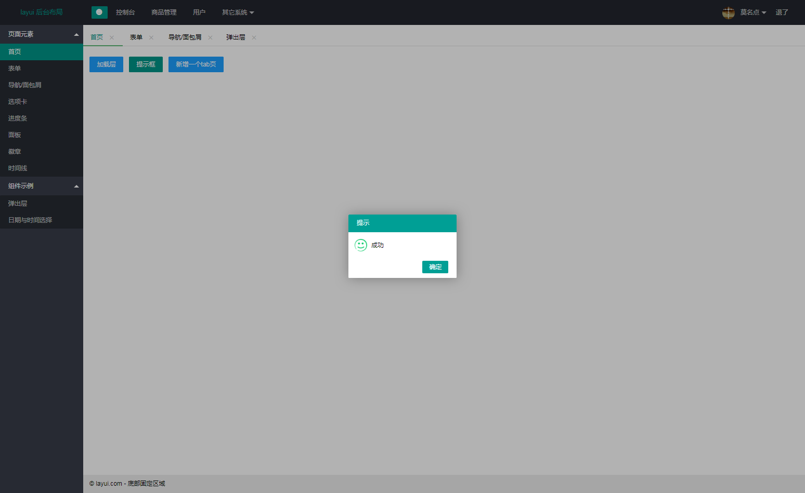

### :point_right: 后台管理系统模板 :point_left:


一眨眼，已经踏入前端这条不归路两年多了，废话就不说了，介绍一下这个模板怎么用，哈哈哈哈。。。。。。。。。。

首先大家都知道怎么把这个模板代码拷到本地吧！！！！！！！！

感觉还可以的就star一下哦！！！！！！

刚刚贤心大佬刚更新了layui 2.2.6，

我也赶紧试了一把，在这里我修改了layui.all.js

支持总数count 和数据data 支持嵌套式书写，数据格式例如
```javascript
[
    content:{
        data:[],
        total:100
    },
    resultCode:200,
    resultMsg:'成功',
]
```
可以直接配置
```json
response: {
      statusName: 'resultCode' //数据状态的字段名称，默认：code
      ,statusCode: 200 //成功的状态码，默认：0
      ,msgName: 'resultMsg' //状态信息的字段名称，默认：msg
      ,countName: 'content.total' //数据总数的字段名称，默认：count
      ,dataName: 'content.data' //数据列表的字段名称，默认：data
    }
```
下面是部分截图




使用这个模板，要了解angular1.x 这个mvvm框架的基本使用方法；

这里使用AMD的规范

r.js 打包

layui css框架

当然还有jquery

首先到项目目录

npm install 或 cnpm install （cnpm 为淘宝镜像大家都懂的）

然后 npm run start 就可以运行起来了

npm run build 是打包的命令

作者 : 丁永亚</br>
---
邮箱  :  yahya_dyy@163.com
----

